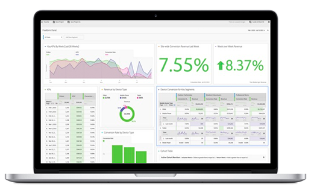

<Hero variant="fullwidth" slots="image, heading, text" background="rgb(5, 1, 29)"/>

# Adobe Analytics

Turn your insight into action.

<TextBlock slots="image, heading, text1, text2, buttons" />

## Insights so rich, they predict success.

Adobe Analytics is the industry-leading solution for applying real-time analytics and detailed segmentation across all of your marketing channels. Use it to discover high-value audiences and power customer intelligence for your business. Adobe Analytics APIs offer limitless ways to integrate your most important customer data into key business processes.

Through RESTful endpoints, your app can query the same metrics and dimensions exposed in Analysis Workspace, dive deep through data with unlimited levels of breakdowns, apply search and segment filters and date ranges, and more.

* [Get started](docs/2.0/)